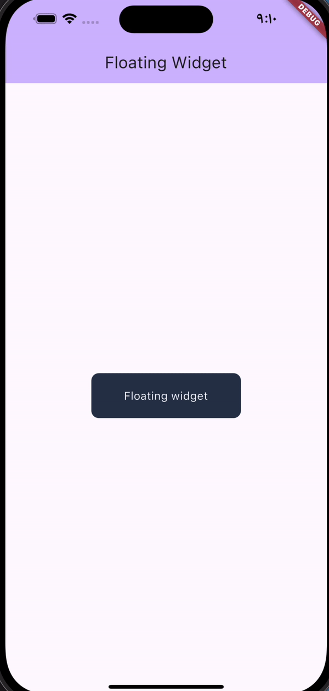
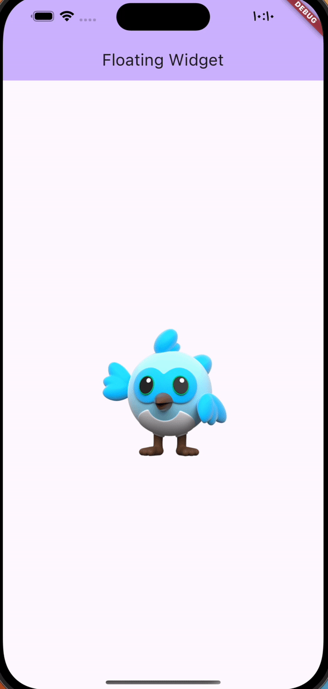

# Floating Widget
[](https://github.com/bakrabdulrahmanhawarieng/floating_widget "Go to GitHub repo")
[](https://github.com/bakrabdulrahmanhawarieng/floating_widget)
[](https://github.com/bakrabdulrahmanhawarieng/floating_widget)
[](https://github.com/bakrabdulrahmanhawarieng/floating_widget/releases/)
[](#license)
[](https://github.com/bakrabdulrahmanhawarieng/floating_widget/issues)

## Intro
A customizable animated floating widget for flutter.
## Getting started

In the `pubspec.yaml` of your flutter project, add the following dependency:

```yaml
dependencies:
  ...
  floating_widget: <latest_version>
```

In your library add the following import:

```dart
import 'package:floating_widget/floating_widget.dart';
```

## Demo




## License

Released under [MIT](/LICENSE) by [@bakrabdulrahmanhawarieng](https://github.com/bakrabdulrahmanhawarieng).

## Contribution

1. Fork it (https://github.com/bakrabdulrahmanhawarieng/floating_widget/fork)
2. Create your feature branch (git checkout -b feature/fooBar)
3. Commit your changes (git commit -am 'Add some fooBar')
4. Push to the branch (git push origin feature/fooBar)
5. Create a new Pull Request# floating_widget
# floating_widget
